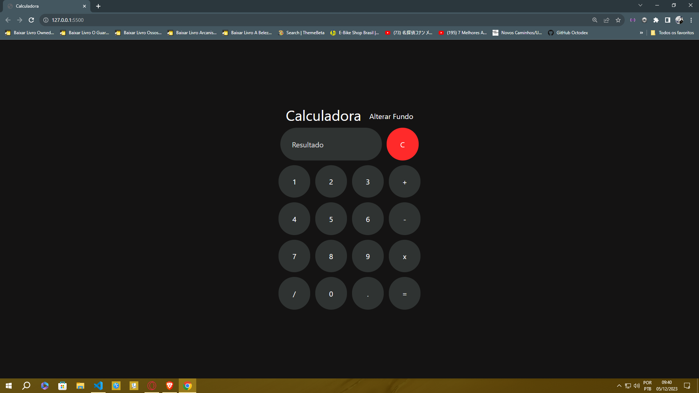

# Calculadora com Javascript

## Descrição do Projeto
 Um pequeno projeto apresentado os pilares da programação web:  
 *  Javascript  
 *  HTML5  
 *  CSS

 Com eles três foi possivel fazer uma calculadora usando as funções do JavaScript e apresentado o display com HTML5 e CSS.

### Imagem da Calculadora JS

